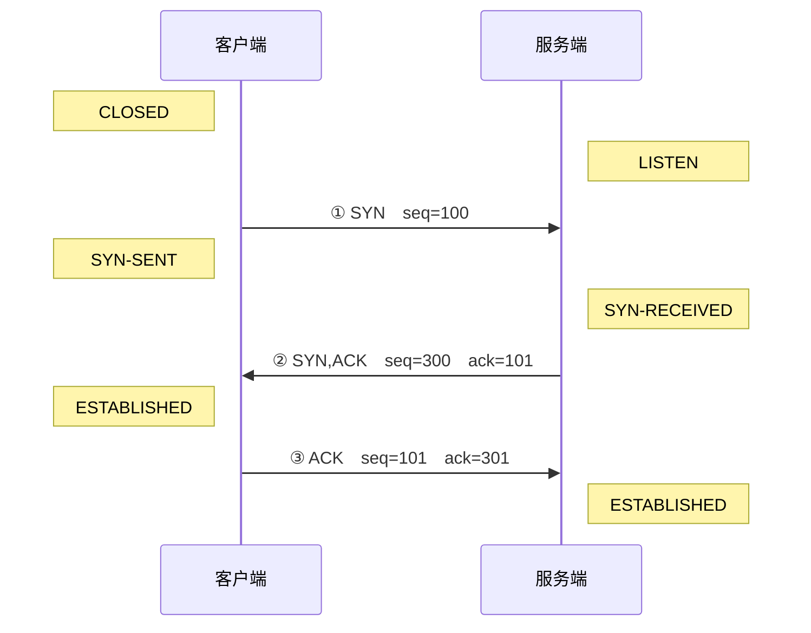

## 前言

很多人在学习三次握手这个重要概念时通常都会死记硬背：先是 `SYN`，然后是 `SYN-ACK`，最后是 `ACK`。但是这种方式完全无法真正理解三次握手的含义。

- 为什么是三次？
- 为什么要三次握手？
- 为什么是 `SYN-ACK`？

这篇文章会带你完整的推导整个三次握手，让你能真正理解这个概念。

在学习 TCP 协议时候，很重要的一个概念就是三次握手。TCP 协议是面向连接的协议，所谓面向连接就是在通信之前，通信双方必须先建立一个连接，建立连接的过程就是三次握手。

---

## TCP 到底想解决什么

TCP 底层的 IP 协议是无连接的协议，也就是说在传输数据包时 IP 不关心包有没有送到，顺序是否正确，以及有没有重复送。

而 TCP 希望能够给上面的应用层提供可靠有序的传输，因此想到了一个办法：给每个字节编号。

- 包乱序到达 → 按编号重排
- 包丢了 → 发现编号有缺口，要求重传
- 包重复了 → 编号重复，丢弃一份



因此有了 **ISN（Initial Sequence number）初始序列号**。TCP 协议是全双工的，所以 ISN 有两个：客户端一个，服务端一个。

## 为什么是三次握手？



<!-- cell -->

**四个动作**

为了同步 ISN，客户端和服务端都必须发送自己的 ISN 并且告诉对方自己收到了对方发送的 ISN。所以过程可以拆成四个动作：

1. 客户端发出自己的 ISN —— 客户端的"发"
2. 服务端确认客户端的 ISN —— 客户端的"收确认"
3. 服务端发出自己的 ISN —— 服务端的"发"
4. 客户端确认服务端的 ISN —— 服务端的"收确认"

<!-- cell -->

**三个报文**

可以注意到我们可以把服务端的第 `2`、`3` 步合并成一个，所以我们把 `SYN` 和 `ACK` 塞进同一个报文里就可以了，这就是 `SYN-ACK` 报文的由来。于是四个动作合并成了三个报文：

1. `SYN` —— 客户端 → 服务端
2. `SYN-ACK` —— 服务端 → 客户端
3. `ACK` —— 客户端 → 服务端



可以发现，现在缺少任何一个报文都会导致双方之一无法完成发送或确认。



## 核心序号数字

在 `SYN` 和 `ACK` 报文中最关键的两个数字是 `seq` 和 `ack`。

- **`seq`（Sequence Number，序列号）**：初始时这个号码是服务器随机生成的 32 位数字。在数据传输中代表了本次发送数据的首字节编号。
- **`ack`（Acknowledgment Number，确认号）**：他告诉对方自己已经收到了发送过来的包，所以它代表自身下一个期待收到的序号，所以它 = 对方的 `seq` + 已收到的数据长度。

然而在握手挥手阶段，由于报文本身不带有数据，但是会虚拟占用一个字节，所以公式为 `ack = seq + 1`。

## 具体流程

以下就是具体三次握手的过程：

三个报文里的数字，逐个拆开看：



<!-- node ① `SYN`　客户端 → 服务端 -->

- `seq=100`：客户端把自己的 ISN 定为 `100`，等于告诉服务端「我这边的数据从 `100` 号字节开始编号」。

<!-- node ② `SYN,ACK`　服务端 → 客户端 -->

服务端一个报文干两件事：

- `seq=300`：服务端向客户端发送自己的 ISN。
- `ack=101`：`SYN` 报文虚占一个字节，`100` 已经被用掉了，所以服务端告诉客户端「我收到了你的报文，接下来你从 `101` 发就可以了」，这同时也确认了 ①。

<!-- node ③ `ACK`　客户端 → 服务端 -->

- `seq=101`：客户端收到了服务端的 `ack`，按照约定从 `101` 开始发。
- `ack=301`：同理，`300` 被服务端的 `SYN` 用掉了，告诉服务端下一个序号从 `301` 发即可，这确认了 ②。







## 总结

看到这里你应该能完全彻底明白什么是三次握手。这个概念并不难，只不过需要一次推导就能记住。最重要的是明白为什么需要三次握手，为什么是三次的这个本质。

接下来你应该能回答以下几个问题：



<!-- folder 三次握手最核心的目的是什么？ -->

同步双方各自的初始序号 ISN

<!-- folder 为什么是三次握手？ -->

因为服务端的 `SYN` 和 `ACK` 可以合并成一个报文

<!-- folder 如果握手只做两次（`SYN`、`SYN-ACK`）会怎么样？ -->

服务端的 ISN 没有得到确认

<!-- folder 客户端 ISN=500，那么服务端 `SYN-ACK` 报文里的 `ack` 字段是多少？ -->

501，因为 `SYN` 虚拟占用一个字节

<!-- folder 为什么 TCP 的初始序号 ISN 必须是随机的？ -->

防止攻击者伪造该连接的报文


